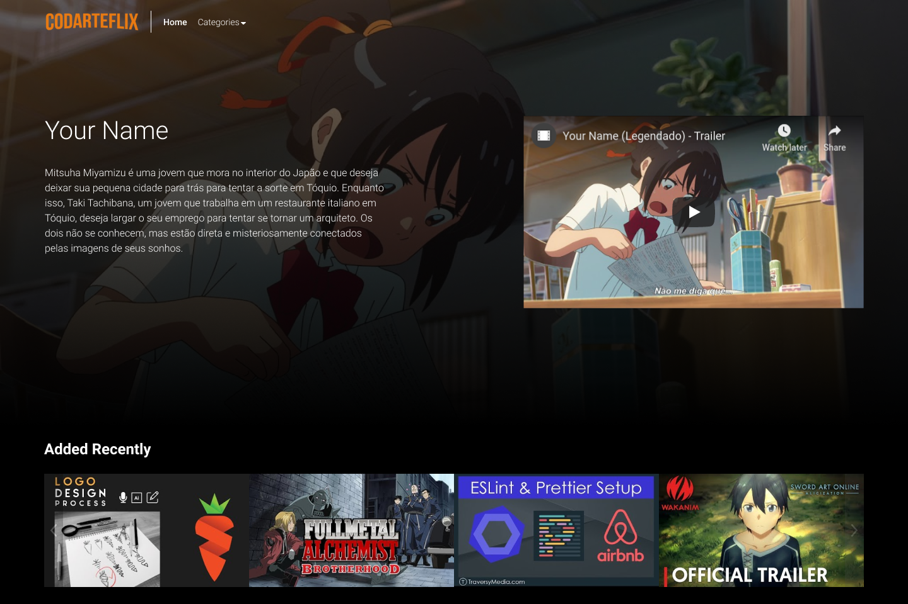

#  Codarteflix

Inicialmente este projeto foi criado na ImersãoReact com o objetivo de aprender o máximo possível de react em uma semana, onde aprendi bastante coisa :).

Logo depois, comecei a olhar para esse projeto como algo que poderia se extender um pouco mais, como assim?! Em cada implementação de biblioteca ou código, você aprende algo, certo? certo!. Então, o objetivo é resumir o que foi feito no código e colocar aqui na documentação, de uma forma que fique fácil de revisar aquele uso de biblioteca ou algoritmo para quando for necessário, usar/relembrar em outro projeto.

## Descrição:
  Este é um projeto visando a prática das habilidades em React tendo como base de UI o site da netflix, podendo também ser incluida outras tecnologias como aprendizado;

## Screenshots

### Libraries:
  - [style-components](##styled-components)
  
  - [react-slick](##react-slick)
  - [react-select](##react-select)
  - [framer-motion](##framer-motion)

## [styled-components](https://styled-components.com/)
-

## [react-slick](https://react-slick.neostack.com/)

-

## [react-select](https://react-select.com/home)

-

## [framer-motion](https://www.framer.com/motion/)

-